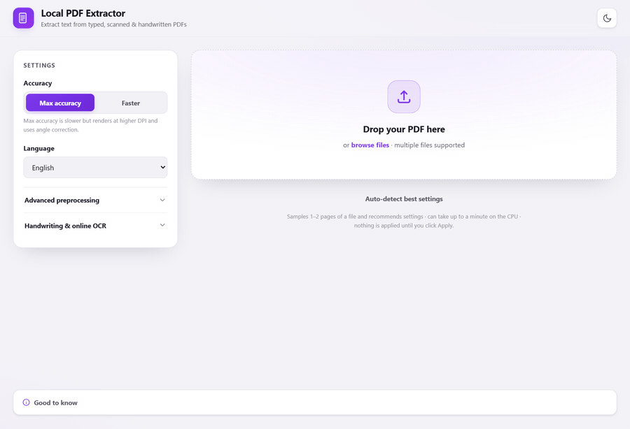

# PDF Extractor

A local PDF text extractor. It pulls a clean, searchable, exportable transcript out of a PDF, whether the file already has a text layer or is a scanned image that needs OCR. It runs on your own machine on CPU, and nothing is uploaded unless you turn on the optional online OCR path yourself.

Live demo: https://huggingface.co/spaces/Archie0099/PDF-Extractor (hosted on a free shared CPU, so OCR is slower than running it locally and the page may take a moment to wake up).



## Features

- Per-page routing: a page that already has a real text layer is read straight from the PDF (exact and instant), and only image pages are rendered and sent through OCR. Mixed PDFs are handled page by page with no mode to choose.
- Local OCR with PaddleOCR (PP-OCRv4), for English and Hindi (Devanagari).
- Image preprocessing before OCR: grayscale, deskew, CLAHE contrast, denoise, optional Sauvola binarization, and gated sharpening.
- Per-page and per-line confidence. Low-confidence lines are highlighted and counted, and an inline editor lets you correct any page. Edits flow through to copy and to every export.
- Optional removal of running headers, footers, and page numbers.
- Exports to plain text, Markdown, Word (.docx), and JSON.
- Live per-page progress over server-sent events, with cancel and remove.
- Optional local handwriting OCR using TrOCR. This is offline but slower and less accurate.
- Optional online OCR using Google Gemini for hard scans and handwriting. It is off by default and needs your own API key, which is stored in the browser and never written to disk by the server.
- Optional knowledge-graph search over a finished document: it extracts entities and `(subject, predicate, object)` facts, embeds them, and answers plain-English questions with hybrid semantic + graph-traversal retrieval, returning the supporting facts and the source page for each answer, plus a graph view and a JSON export. It is opt-in and uses Gemini (the same key as online OCR); the graph is built with the standard library and numpy, with no extra dependencies.
- Corrupt PDFs are repaired with pikepdf where possible. Encrypted PDFs are rejected with a clear message.

## Getting started

You need Python 3.10 (3.11 should also work) and about a gigabyte of free disk for the OCR model weights, which download once on first use.

From the project folder on Windows:

```bat
python -m venv .venv
.venv\Scripts\activate
pip install -r requirements.txt
python -m uvicorn app:app --port 8000
```

On macOS or Linux the only difference is activating the virtual environment with `source .venv/bin/activate`.

Wait for `Application startup complete`, then open http://localhost:8000 in a browser. Drop in a PDF and the text appears page by page as it is processed.

The first OCR run downloads the PaddleOCR weights (a few hundred megabytes), so it takes a while. After that the models are cached and startup is fast.

Local handwriting mode is optional and heavy. If you want it, install the extra dependencies:

```bat
pip install -r requirements-handwriting.txt --extra-index-url https://download.pytorch.org/whl/cpu
```

Online OCR is also optional. To use it, get a free Google AI Studio API key, paste it into the online OCR field in the UI, and enable the toggle.

### One-click launch on Windows

`Start PDF Extractor.bat` runs the same server and opens it in a new browser window. The app stays alive as long as the launcher console window is open, so close that window to stop it.

## How it works

The backend is FastAPI. It serves a single-page vanilla JavaScript UI from `static/` and exposes a small JSON and SSE API.

Uploading a PDF creates a job. Each page is routed independently. If the page has a usable text layer it is read directly from the PDF and reconstructed into reading order. Otherwise the page is rendered to an image, preprocessed, and passed to the OCR engine. When the online path is enabled it takes precedence for pages that need OCR.

PyMuPDF (fitz) is not thread-safe, so every PDF and rendering call is funneled through a single worker thread. Page results stream back to the browser over server-sent events, and finished jobs are evicted from memory after a timeout. Nothing is written to disk.

The pipeline is split into focused modules under `pipeline/`:

- `textlayer.py`: text-layer detection and reading-order rebuild.
- `extractor.py`: the per-page routing between text layer, OCR, handwriting, and online.
- `preprocess.py`: the OpenCV preprocessing steps.
- `ocr_engine.py`: the PaddleOCR singleton and warmup.
- `handwriting.py`: the optional TrOCR engine.
- `online_ocr.py`: the optional Gemini client, written against the standard library.
- `kg.py`: the optional knowledge graph: Gemini triple extraction and node embeddings, a pure-Python graph with numpy vectors, and hybrid semantic plus graph-traversal search.
- `postprocess.py`: header, footer, and page-number stripping with a strict data-safety contract.
- `analyze.py`: a settings recommender that samples a few pages and suggests options.
- `export_docx.py`: Word export.
- `jobs.py`: the async job manager, progress fan-out, cancel, and eviction.

## Tests

The suite uses pytest and a FastAPI test client. Pure-function tests need no model load; the API tests warm the OCR engine once per session.

```bat
python -m pytest
```
